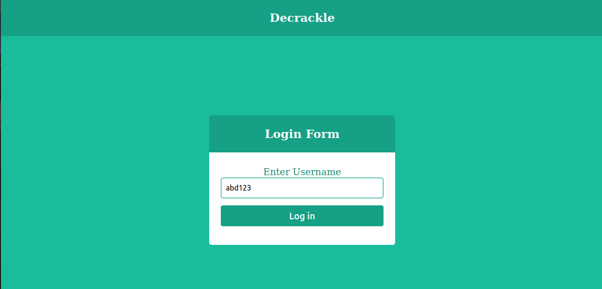
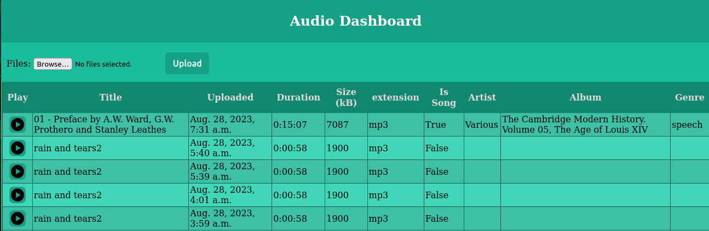

# audio_dashboard

## Steps to setup project

Clone the Repository:

``` git clone https://github.com/00AR/audio_dashboard.git ```

To install the dependencies, open audio_dashboard directory in the terminal and run the command:

``` python -m pip install requirements.txt ```

Database environment variables
```
DATABASE_NAME
DATABASE_USER
DATABASE_PASSWORD
DATABASE_HOST
DATABASE_PORT
```
## Screenshots
- User Login Page:

- Audio Dashboard Page:

## Working
There are two pages in the app: Login page and Audio dashboard.

On the login page user enters his username and submits. The application checks whether a user with the input username exists in the database if it exists, the user id is stored in the session if the user does not exists a user a created with the input username and the new user is stored in the session. Then user is redirected to Audio dashboard. The login is kept simple and hence is not secure.

On the Audio dashboard, user can view his uploaded files along with metadata. User is also given the functionality of uploading more files. Here user can select one or more files to upload. Once "Upload" button is clicked, the uploaded files have to pass two Validation checks: **a)** It should be an audio file, **b)** It should not have duration longer than 10 minutes. Once these are passed, the files are uploaded to the server.

The app uses two models: User and Audio. The User model stores user data and is used for authenitcation. The Audio model is used to store the metadata of the uploaded audio files. The user can login in using his user name. 

I have used mutagen library to extract the meta data of the audio file, and store the meta data in the database. The play audio functionality is added by simply returning the audio file and the browser do the task of playing. 
